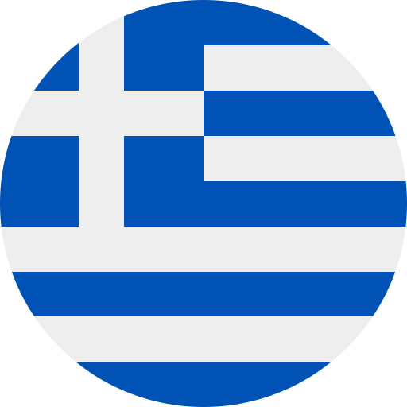

<!--
**leonalkalai/leonalkalai** is a ✨ _special_ ✨ repository because its `README.md` (this file) appears on your GitHub profile.

Here are some ideas to get you started:

- 🔭 I’m currently working on ...
- 🌱 I’m currently learning ...
- 👯 I’m looking to collaborate on ...
- 🤔 I’m looking for help with ...
- 💬 Ask me about ...
- 📫 How to reach me: ...
- 😄 Pronouns: ...
- ⚡ Fun fact: ...
-->

### Hi there 👋
- My name is " Leon Kountouras "
- If you like to you can 😄 pronounce me as : [... "Baby Coder"]

🔭 I’m currently
  - 🌱 learning to be a professional Full Stack Developer
  - 🔭 working on a team project
  - 👯 collaborating with my fellow coders

- 🤔 I’m looking for help with ... Well not exactly. I'm not really looking for help but i can help you instead
- 💬 Ask me about a problem you can't solve and maybe i can assist you 🔨
- 📫 How to reach me: You can 📧 pm me at koundouras@gmail.com

- ⚡ Fun fact: I have been coding for years but still not found a job as a developer. Well i am at  &nbsp; &nbsp;   &nbsp; &nbsp; so you know....

<picture>
 <source media="(prefers-color-scheme: dark)" srcset="https://avatars.githubusercontent.com/u/21139137?v=4">
 <source media="(prefers-color-scheme: light)" srcset="https://avatars.githubusercontent.com/u/21139137?v=4">
 
</picture>

